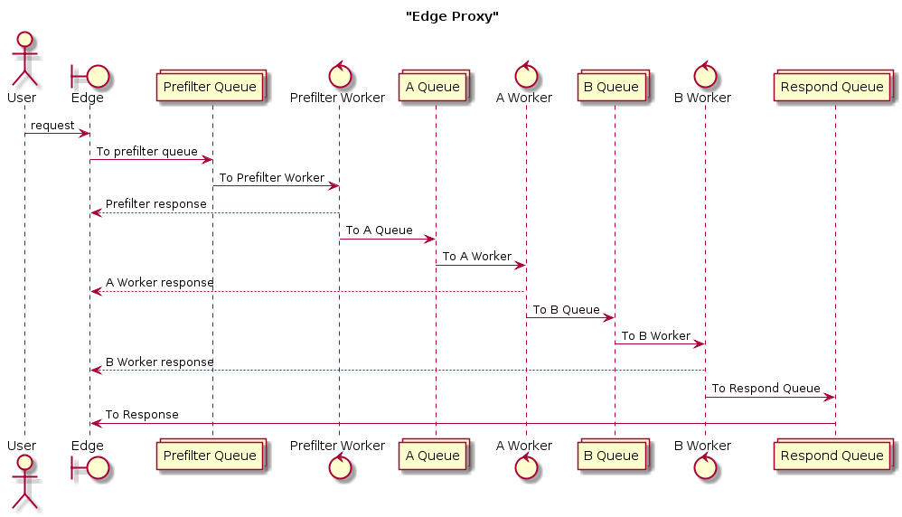

## Overview

### Run using docker

`docker-compose up`

### W/O docker
adjust the redis config in `edge.go` from `redis:6379` to `:6379` then:
`make run`

### test using ab or hey
`ab -n 2 http://localhost:9001/`
`hey -n 50 http://localhost:9001/`

### with concurrency
`ab -c 10 -n 50 http://localhost:9001/`
`hey -c 10 -n 50 http://localhost:9001/`


#### The problem as seen in the logs:

```
# first request, all looks good
2019/01/08 05:07:34 context: &{0xc42000aa00 0xc420014a20 / [] [] map[] 0x741760 map[] 0xc42013a000}
2019/01/08 05:07:34 Setting key on redis: fBKq4Vge146vSA07iIQOsvVYOI1F7pSY, {},
2019/01/08 05:07:34 Publishing: pre-filter:fBKq4Vge146vSA07iIQOsvVYOI1F7pSY
2019/01/08 05:07:34 My id looks good here::: fBKq4Vge146vSA07iIQOsvVYOI1F7pSY
2019/01/08 05:07:34 val: {"foo":"bar","baz":"fBKq4Vge146vSA07iIQOsvVYOI1F7pSY"}, err: <nil>
edge_1    | {"time":"2019-01-08T05:07:34.4454909Z","id":"fBKq4Vge146vSA07iIQOsvVYOI1F7pSY","remote_ip":"172.21.0.1","host":"localhost:9001","method":"GET","uri":"/","user_agent":"ApacheBench/2.3","status":200,"error":"","latency":14514100","latency_human":"14.5141ms","bytes_in":0,"bytes_out":54}

...

# second request, the requestID seems to come from the first request????
2019/01/08 05:07:34 context: &{0xc42011a300 0xc420014a20 / [] [] map[] 0x741760 map[] 0xc42013a000}
2019/01/08 05:07:34 Setting key on redis: aTYfyHzSLmBatIQgCDoMxlpHUNRqW2dM, {},
2019/01/08 05:07:34 Publishing: pre-filter:aTYfyHzSLmBatIQgCDoMxlpHUNRqW2dM
2019/01/08 05:07:34 My id looks good here::: aTYfyHzSLmBatIQgCDoMxlpHUNRqW2dM
2019/01/08 05:07:34 My id does not look correct anymore::: fBKq4Vge146vSA07iIQOsvVYOI1F7pSY
2019/01/08 05:07:34 Not Found! id: fBKq4Vge146vSA07iIQOsvVYOI1F7pSY, payload: aTYfyHzSLmBatIQgCDoMxlpHUNRqW2dM

```

### Other things I have tried

#### No channels:
https://github.com/earlonrails/go-edge-proxy/blob/93d85b5ded5031bda9386400e5992be414ab8e5e/edge.go

#### Reading from the goredis channel using `for range` style as described here:
https://github.com/go-redis/redis/blob/0064936c5b77c874f8e1f089c955ec8bef3818c4/sentinel.go#L353

#### Using the channel implementation from goredis in a channel 

```
package main

import (
  "encoding/json"
  "fmt"
  "github.com/go-redis/redis"
  "github.com/labstack/echo"
  "log"
  "net/http"
  "time"
)

const (
  PreFilterChannelName string = "pre-filter"
  RespondChannelName   string = "respond"
)

var (
  redisdb   *redis.Client
  respond   *redis.PubSub
)

type response struct {
  Status    int
  Value     string
}

func init() {
  redisdb = redis.NewClient(&redis.Options{
    Addr:         "redis:6379",
    DialTimeout:  10 * time.Second,
    ReadTimeout:  30 * time.Second,
    WriteTimeout: 30 * time.Second,
    PoolSize:     10,
    PoolTimeout:  30 * time.Second,
  })
  respond = redisdb.PSubscribe(fmt.Sprintf("%v:*", RespondChannelName))
  // Wait for confirmation that subscription is created before publishing anything.
  _, err := respond.Receive()
  if err != nil {
      panic(err)
  }
}

func EdgeController(c echo.Context) error {
  var (
    cJson     []byte
    val       string
    err       error
  )

  log.Printf("context: %v", c)
  cJson, err = json.Marshal(c)
  if err != nil {
    log.Printf("Got Error Marshal: %v, %v", cJson, err.Error())
    return c.String(http.StatusInternalServerError, fmt.Sprintf("error: %v", err.Error()))
  }

  requestID := c.Response().Header().Get(echo.HeaderXRequestID)
  // Store the request object on key requestID.
  // no ttl
  // err = redisdb.Set(requestID, string(cJson), 0).Err()
  // ttl 300000000 * time.Nanosecond == 300 milliseconds
  log.Printf("Setting key on redis: %v, %v, ", requestID, string(cJson))
  err = redisdb.Set(requestID, string(cJson), 300000000 * time.Nanosecond).Err()
  if err != nil {
    log.Printf("Got Error Set: %v", err.Error())
    return c.String(http.StatusInternalServerError, fmt.Sprintf("error: %v", err.Error()))
  }

  resp := make(chan response)
  go func() {
    // Go channel which receives messages.
    ch := respond.Channel()
    // Consume messages.
    for msg := range ch {
      payload := msg.Payload
      id := c.Response().Header().Get(echo.HeaderXRequestID)
      if id == payload {
        log.Printf("Found matching request: %v, %v", msg.Channel, payload)
        // Read request object.
        val, err = redisdb.Get(id).Result()
        log.Printf("val: %v, err: %v", val, err)
        if err != nil {
          resp <- response{http.StatusInternalServerError, err.Error()}
          close(resp)
          break
        }
        resp <- response{http.StatusOK, val}
        close(resp)
        break
      } else {
        log.Printf("Request Not FOUND!!!: looking for: %v, Have: %v", id, payload)
        continue
      }
    }
  }()
  // Publish a message.
  log.Println("log Publish")
  log.Printf("Publishing: %v", fmt.Sprintf("%v:%v", PreFilterChannelName, requestID))
  err = redisdb.Publish(fmt.Sprintf("%v:%v", PreFilterChannelName, requestID), requestID).Err()
  if err != nil {
    log.Printf("Got Error Publish: %v", err.Error())
    return c.String(http.StatusInternalServerError, fmt.Sprintf("error: %v", err.Error()))
  }

  r := <-resp
  return c.String(r.Status, r.Value)
}

```

So far I have had no luck, all I want to do is publish json to a redis pubsub and then wait for a response on another channel. The idea you get an http request and put it in a queue. Then you have any number of workers which can do some work then forward the reques to the next queue. Finally when everything is done the request goes to a respond queue. The http server has been listening to the respond queue, blocking waiting, the whole time and once it receives this message it will read the value of what to respond to the request.

